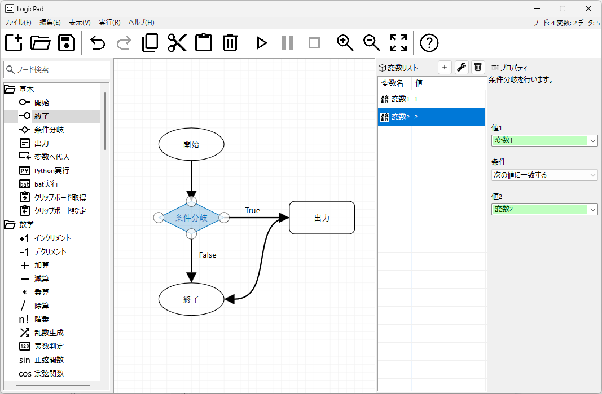

---

## About
LogicPad is a low-code application development platform that simplifies the process of building software applications on the Windows operating system.
It provides an intuitive interface and drag-and-drop functionality, allowing users to create applications without extensive programming knowledge.

---

## Download

[Setup.exe (beta)](https://github.com/LogicCreate/LOGIC-MAIN.github.io/releases/download/0.0.0.59/Setup.exe)

---

## Screenshot

---

## History

| Date       | Version | Description                                                                                                                                      |
|------------|---------|--------------------------------------------------------------------------------------------------------------------------------------------------|
|2025/04/03  | 0.0.0.59(beta) | Add Perplexity node                                                                                                                              |
|2025/04/03  | 0.0.0.58(beta) | - Added a node to generate images using Stable Diffusion  - Added a node to get mouse coordinates  - Added a node to set mouse coordinates |
|2025/04/03  | 0.0.0.57(beta)| First release                                                                                                                                    |

---

## Contact

contact@logicpad.org

---
